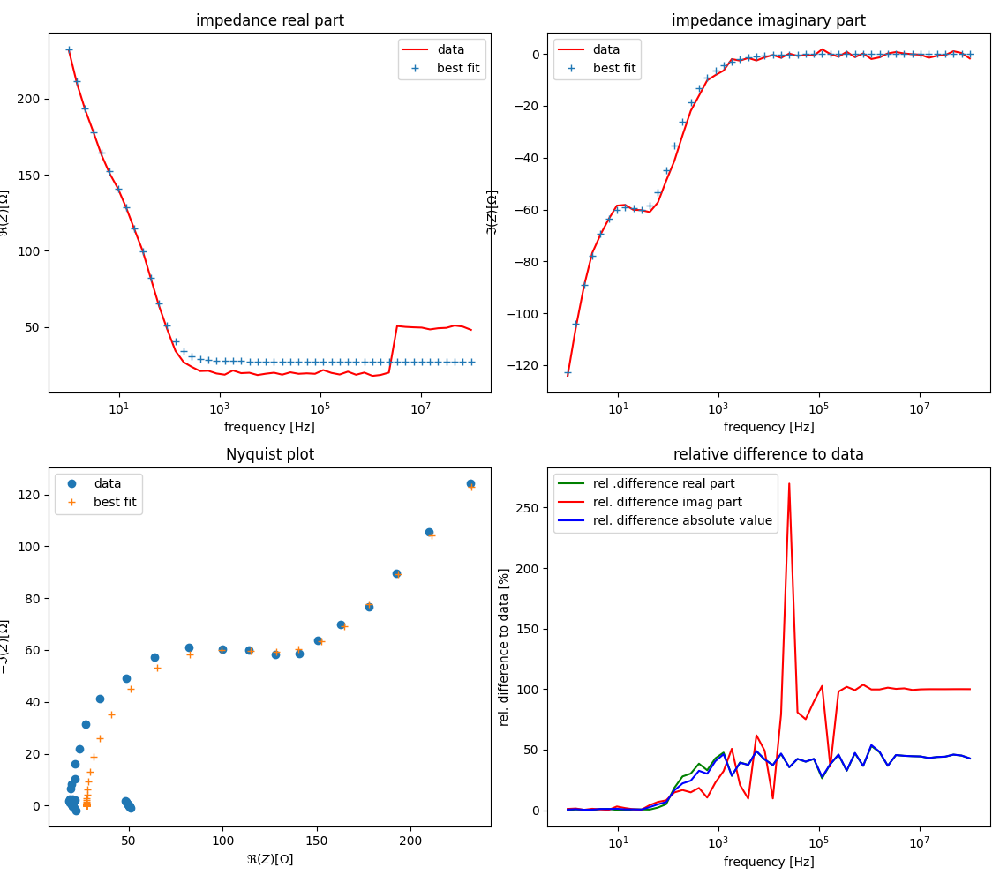
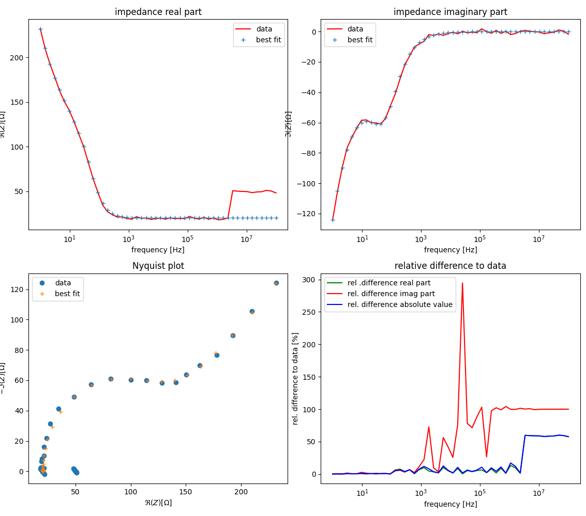

Customizing the solver
----------------------

The previous example :ref:`example_fitting` is chosen again.

This time, noise and outliers are added to the data

.. literalinclude:: ../../examples/Randles/randles_solver.py
	:lines: 27-36

When running the fit with the standard least-squares solver, we obtain

Instead, we can customize the solver:

.. literalinclude:: ../../examples/Randles/randles_solver.py
	:lines: 60-64

and obtain

See Also
^^^^^^^^

:download:`examples/Randles/randles_solver.py <../../examples/Randles/randles_solver.py>`.

